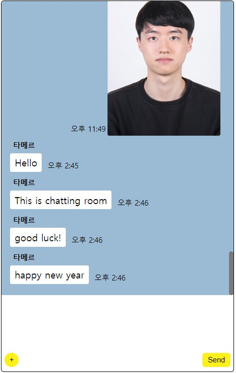
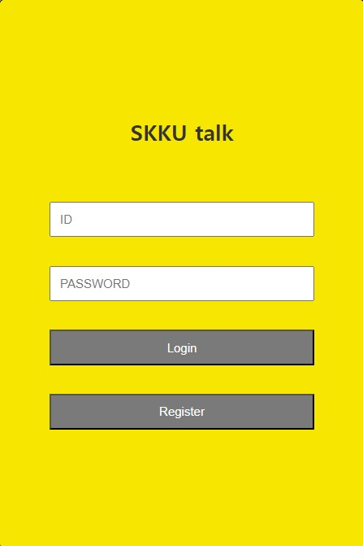
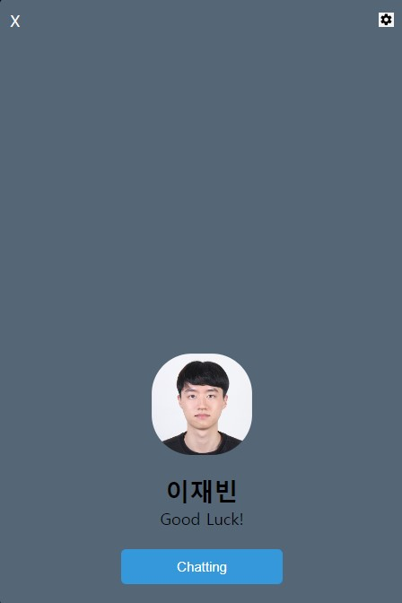

# 채팅 앱(ChatApp)

## 프로젝트 소개:

채팅 앱(ChatApp)은 카카오톡과 유사한 사용자 경험을 제공하는 웹 기반 채팅 플랫폼입니다. 사용자들은 로그인, 회원가입, 프로필 관리, 친구 목록 관리, 1대1 채팅, 단체 채팅, 그리고 사진 공유 등 다양한 기능을 통해 소통의 즐거움을 느낄 수 있습니다.

### 주요 기능

로그인 및 회원가입
프로필 관리
친구 목록
채팅 기능
사진 공유

### 기술 스택

FastAPI: 빠르고 안정적인 웹 프레임워크를 통해 효율적인 서비스를 제공합니다.
SQLite: 경량 데이터베이스로 간단하게 데이터를 관리하며 신속한 응답을 가능케 합니다.

### 시작하기

저장소를 클론합니다.

uvicorn main:app --reload
브라우저에서 http://127.0.0.1:8000으로 접속하여 서비스를 이용하세요.

### 사진

